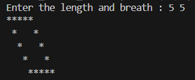

# ELEVATE_BATCH_2025
This repo contains all the homework code given during the 2025 Elevate batch
# date 26 March
1. Write a code using recursion for printing binary, octal, hexadecimal for the given number.
[Answer](https://github.com/RajRipuBhanjanSharma-1477/ELEVATE_BATCH_2025/blob/main/C%20Code%20HW/26_1hw.c)
# date 25 March
1. Write a function for factorial
[Answer](https://github.com/RajRipuBhanjanSharma-1477/ELEVATE_BATCH_2025/blob/main/C%20Code%20HW/25_1hw.c)
2. Write a function for print the table of a given number
[Answer](https://github.com/RajRipuBhanjanSharma-1477/ELEVATE_BATCH_2025/blob/main/C%20Code%20HW/25_2hw.c)
3. Write a programe to find wether the given function is a prime number or not
[Answer](https://github.com/RajRipuBhanjanSharma-1477/ELEVATE_BATCH_2025/blob/main/C%20Code%20HW/25_3hw.c)
4. Write function to determine wheter the given number is perfect number
[Answer](https://github.com/RajRipuBhanjanSharma-1477/ELEVATE_BATCH_2025/blob/main/C%20Code%20HW/25_4hw.c)
5. Write a function to check wether the given number is strong number
[Answer](https://github.com/RajRipuBhanjanSharma-1477/ELEVATE_BATCH_2025/blob/main/C%20Code%20HW/25_5hw.c)
6. Create a function  to check wether the given function is a armstrong number
[Answer](https://github.com/RajRipuBhanjanSharma-1477/ELEVATE_BATCH_2025/blob/main/C%20Code%20HW/25_6hw.c)
# date 21 March
1. printing solid diamond pattern.
[Answer](https://github.com/RajRipuBhanjanSharma-1477/ELEVATE_BATCH_2025/blob/main/C%20Code%20HW/21_3_2025Q1.c)
2. printing hollow diamond pattern.
[Answer](https://github.com/RajRipuBhanjanSharma-1477/ELEVATE_BATCH_2025/blob/main/C%20Code%20HW/21_3_2025Q2.c)
3. print the following pattern.\
\
[Answer](https://github.com/RajRipuBhanjanSharma-1477/ELEVATE_BATCH_2025/blob/main/C%20Code%20HW/21_3_2025Q3.c)
4. print the following pattern.\
\
[Answer](https://github.com/RajRipuBhanjanSharma-1477/ELEVATE_BATCH_2025/blob/main/C%20Code%20HW/21_3_2025Q4.c)
5. print the following pattern.\
\
[Answer](https://github.com/RajRipuBhanjanSharma-1477/ELEVATE_BATCH_2025/blob/main/C%20Code%20HW/21_3_2025Q5.c)
# date 19 march
1. print the followning pattern :\
Solid Rhombus\
\
[Answer](https://github.com/RajRipuBhanjanSharma-1477/ELEVATE_BATCH_2025/blob/main/C%20Code%20HW/Backwar_Solid_rombus.c)\
Hollow Rhombus\
\
[Answer](https://github.com/RajRipuBhanjanSharma-1477/ELEVATE_BATCH_2025/blob/main/C%20Code%20HW/backward_hollow_rombus.c)\
Triangle\
\
[Answer](https://github.com/RajRipuBhanjanSharma-1477/ELEVATE_BATCH_2025/blob/main/C%20Code%20HW/hollow_triangle.c)
